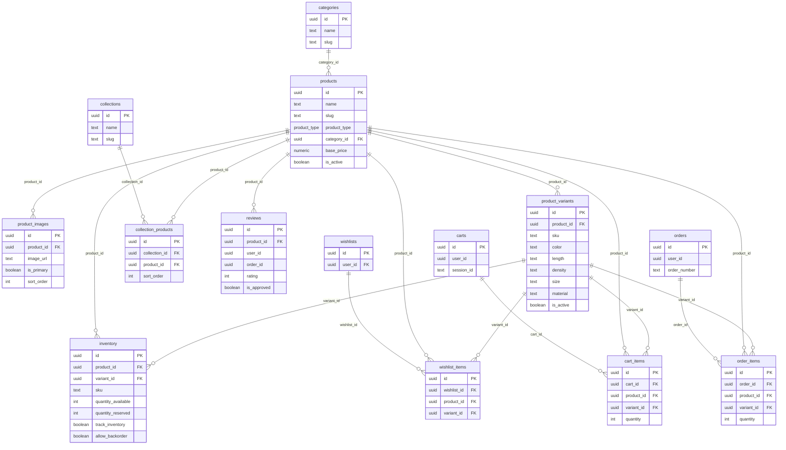

## Product Domain ER Diagram

This ER diagram covers the core product and commerce tables as defined in `supabase/migrations/001_schema.sql`.

```mermaid
erDiagram
  categories {
    uuid id PK
    text name
    text slug
  }

  collections {
    uuid id PK
    text name
    text slug
  }

  products {
    uuid id PK
    text name
    text slug
    product_type product_type
    uuid category_id FK
    numeric base_price
    boolean is_active
  }

  product_images {
    uuid id PK
    uuid product_id FK
    text image_url
    boolean is_primary
    int sort_order
  }

  product_variants {
    uuid id PK
    uuid product_id FK
    text sku
    text color
    text length
    text density
    text size
    text material
    boolean is_active
  }

  inventory {
    uuid id PK
    uuid product_id FK
    uuid variant_id FK
    text sku
    int quantity_available
    int quantity_reserved
    boolean track_inventory
    boolean allow_backorder
  }

  collection_products {
    uuid id PK
    uuid collection_id FK
    uuid product_id FK
    int sort_order
  }

  reviews {
    uuid id PK
    uuid product_id FK
    uuid user_id
    uuid order_id
    int rating
    boolean is_approved
  }

  wishlists {
    uuid id PK
    uuid user_id FK
  }

  wishlist_items {
    uuid id PK
    uuid wishlist_id FK
    uuid product_id FK
    uuid variant_id FK
  }

  carts {
    uuid id PK
    uuid user_id
    text session_id
  }

  cart_items {
    uuid id PK
    uuid cart_id FK
    uuid product_id FK
    uuid variant_id FK
    int quantity
  }

  orders {
    uuid id PK
    uuid user_id
    text order_number
  }

  order_items {
    uuid id PK
    uuid order_id FK
    uuid product_id FK
    uuid variant_id FK
    int quantity
  }

  categories ||--o{ products : "category_id"
  products ||--o{ product_images : "product_id"
  products ||--o{ product_variants : "product_id"
  products ||--o{ inventory : "product_id"
  product_variants ||--o{ inventory : "variant_id"
  collections ||--o{ collection_products : "collection_id"
  products ||--o{ collection_products : "product_id"
  products ||--o{ reviews : "product_id"
  wishlists ||--o{ wishlist_items : "wishlist_id"
  products ||--o{ wishlist_items : "product_id"
  product_variants ||--o{ wishlist_items : "variant_id"
  carts ||--o{ cart_items : "cart_id"
  products ||--o{ cart_items : "product_id"
  product_variants ||--o{ cart_items : "variant_id"
  orders ||--o{ order_items : "order_id"
  products ||--o{ order_items : "product_id"
  product_variants ||--o{ order_items : "variant_id"
```

